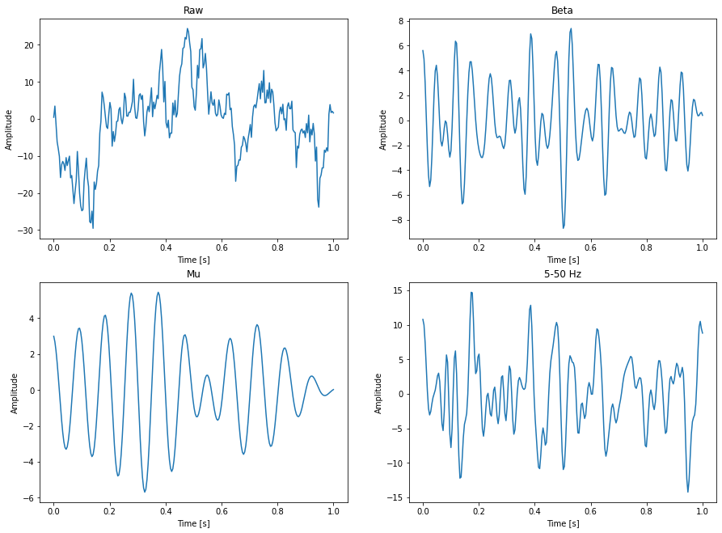
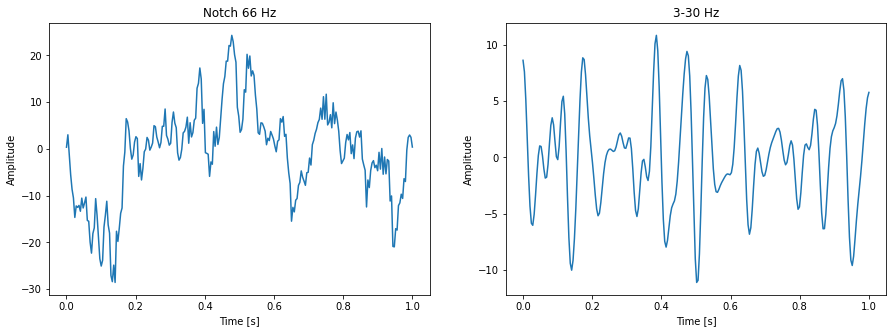
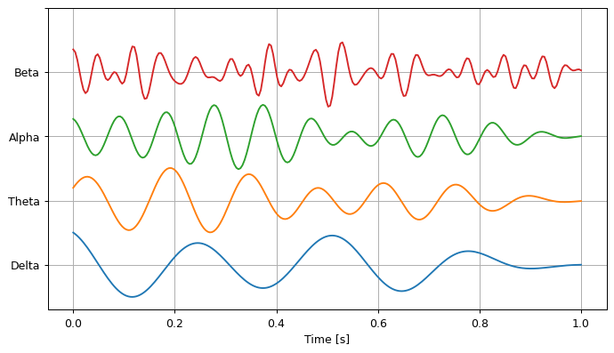

.. code:: ipython3

    from gcpds.utils import loaddb
    from matplotlib import pyplot as plt
    import numpy as np

EEG Filters
===========

.. code:: ipython3

    from gcpds.utils import filters as flt

.. code:: ipython3

    db = loaddb.BCI2a('BCI2a_database')
    db.load_subject(1)
    run, _ = db.get_run(0)
    fs = db.metadata['sampling_rate']
    trial = run[0,0][:fs]
    trial.shape

.. parsed-literal::

    (250,)

There are some predefined filters: ``notch60``, ``band545``,
``band330``, ``band245``, ``band440``, ``delta``, ``theta``, ``alpha``,
``beta``, ``band1100``, ``mu``, ``band150``, ``band713``, ``band1550``
and ``band550``

.. code:: ipython3

    plt.figure(figsize=(15, 11))
    
    t = np.linspace(0, trial.shape[0]/fs, trial.shape[0])
    
    plt.subplot(221)
    plt.title('Raw')
    plt.plot(t, trial)
    plt.xlabel('Time [s]')
    plt.ylabel('Amplitude')
    
    plt.subplot(222)
    plt.title('Beta')
    plt.plot(t, flt.beta(trial, fs=fs))
    plt.xlabel('Time [s]')
    plt.ylabel('Amplitude')
    
    plt.subplot(223)
    plt.title('Mu')
    plt.plot(t, flt.mu(trial, fs=fs))
    plt.xlabel('Time [s]')
    plt.ylabel('Amplitude')
    
    plt.subplot(224)
    plt.title('5-50 Hz')
    plt.plot(t, flt.band550(trial, fs=fs))
    plt.xlabel('Time [s]')
    plt.ylabel('Amplitude')
    
    plt.show()

A custom filter can be declared with the methods ``GenericButterBand``
and ``GenericNotch``

.. code:: ipython3

    notch66 =  flt.GenericNotch(f0=66, fs=fs)
    band830 =  flt.GenericButterBand(f0=8, f1=30, fs=fs)

.. code:: ipython3

    plt.figure(figsize=(15, 5))
    
    plt.subplot(121)
    plt.title('Notch 66 Hz')
    plt.plot(t, notch66(trial, fs=fs))
    plt.xlabel('Time [s]')
    plt.ylabel('Amplitude')
    
    plt.subplot(122)
    plt.title('3-30 Hz')
    plt.plot(t, band830(trial, fs=fs))
    plt.xlabel('Time [s]')
    plt.ylabel('Amplitude')
    
    plt.show()

The same filter is automatically recompilled for a different sampling
rate.

.. code:: ipython3

    plt.figure(figsize=(15, 5))
    
    plt.subplot(121)
    plt.title('Notch 66 Hz')
    plt.plot(t, notch66(trial, fs=fs))
    plt.xlabel('Time [s]')
    plt.ylabel('Amplitude')
    
    plt.subplot(122)
    plt.title('3-30 Hz')
    plt.plot(t, band830(trial, fs=fs))
    plt.xlabel('Time [s]')
    plt.ylabel('Amplitude')
    
    plt.show()

For brain waves.

.. code:: ipython3

    plt.figure(figsize=(9, 5), dpi=90)
    
    for i, filter_ in enumerate([flt.delta, flt.theta, flt.alpha, flt.beta]):
        eeg_ = filter_(trial, fs=250)
        eeg_ = eeg_/(eeg_.max()-eeg_.min())
        plt.plot(t, eeg_+i)
        
    plt.grid(True)
    plt.yticks(range(5), ['Delta', 'Theta', 'Alpha', 'Beta'])
    plt.xlabel('Time [s]')
    
    plt.show()

--------------

References
~~~~~~~~~~

-  `Butterworth digital and analog filter
   design <https://docs.scipy.org/doc/scipy/reference/generated/scipy.signal.butter.html#scipy.signal.butter>`__
-  `Design second-order IIR notch digital
   filter <https://docs.scipy.org/doc/scipy/reference/generated/scipy.signal.iirnotch.html#scipy.signal.iirnotch>`__
-  `Apply a digital filter forward and backward to a
   signal. <https://docs.scipy.org/doc/scipy/reference/generated/scipy.signal.filtfilt.html#scipy.signal.filtfilt>`__

