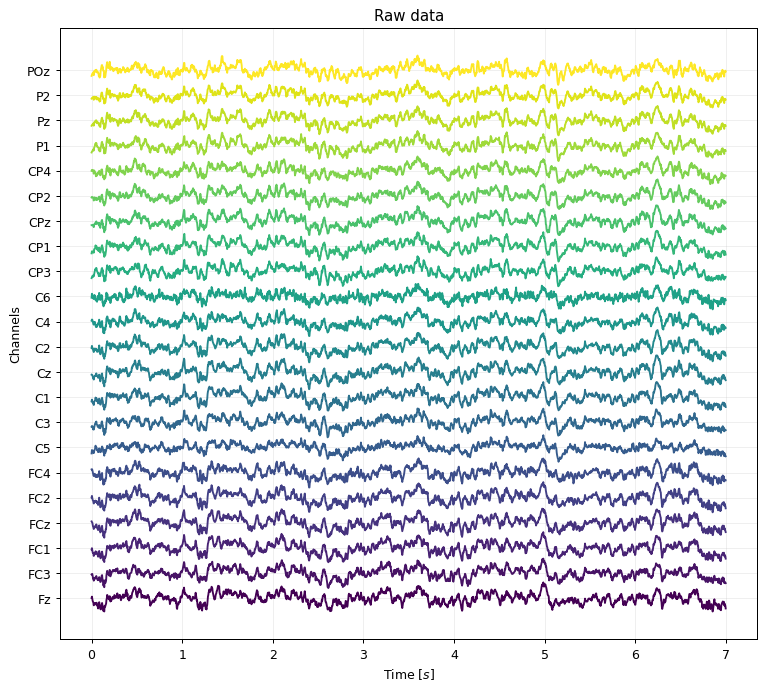
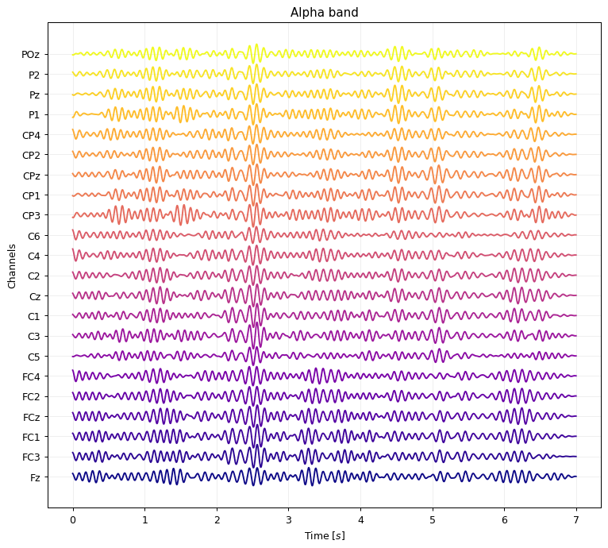

.. code:: ipython3

    from gcpds.utils import loaddb
    from gcpds.utils import filters as flt
    from matplotlib import pyplot as plt
    from ipywidgets import interact
    
    db = loaddb.BCI2a('BCI2a_database')
    db.load_subject(1)
    data, classes = db.get_run(0)
    data = data[0]
    channels = db.channels
    fs = db.fs

Visualizations
==============

EEG
---

.. code:: ipython3

    from gcpds.utils.visualizations import plot_eeg

.. code:: ipython3

    plt.figure(figsize=(10, 9), dpi=90)
    plt.title('Raw data')
    plot_eeg(data, channels, fs, sca=1.5)
    
    print(data.shape)
    print(channels)
    plt.show()

.. parsed-literal::

    (22, 1750)
    ['Fz', 'FC3', 'FC1', 'FCz', 'FC2', 'FC4', 'C5', 'C3', 'C1', 'Cz', 'C2', 'C4', 'C6', 'CP3', 'CP1', 'CPz', 'CP2', 'CP4', 'P1', 'Pz', 'P2', 'POz']

.. code:: ipython3

    plt.figure(figsize=(10, 9), dpi=90)
    plt.title('Alpha band')
    plot_eeg(flt.alpha(data, fs=fs), channels, fs, sca=1.5, cmap='plasma')
    plt.show()

Topoplot
--------

.. code:: ipython3

    from gcpds.utils.visualizations import plot_topoplot

.. code:: ipython3

    plt.figure(figsize=(6, 6), dpi=90)
    plot_topoplot(data.mean(axis=1), channels, fs, cmap='coolwarm')
    plt.show()

.. image:: 03-visualizations_files/03-visualizations_8_0.png

.. code:: ipython3

    @interact(s=(0, (data.shape[1])/fs, 0.1))
    def _(s=0):
        plt.figure(figsize=(6, 6), dpi=90)
        plot_topoplot(data[:,int(s*fs)-1], channels, fs, cmap='coolwarm', vmin=data.min(), vmax=data.max())
        plt.show()

.. parsed-literal::

    interactive(children=(FloatSlider(value=0.0, description='s', max=7.0), Output()), _dom_classes=('widget-inter…

