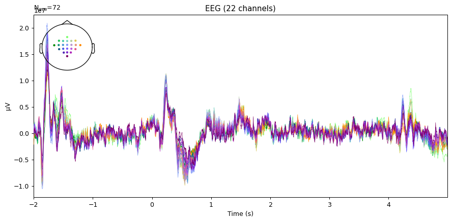
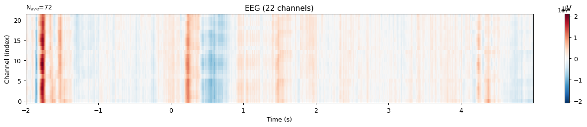
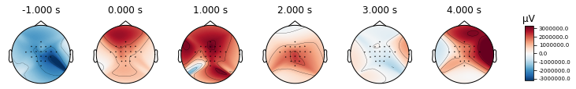
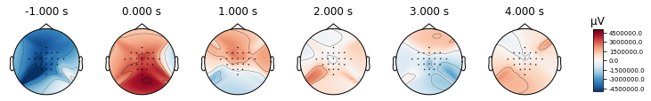
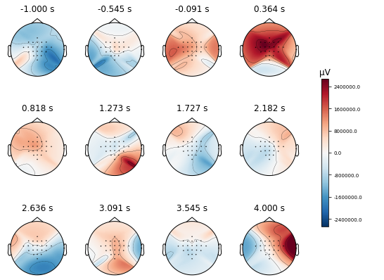

.. code:: ipython3

    import numpy as np
    from matplotlib import pyplot as plt
    import mne

MNE integration
===============

In `Databases handler <01-databases.html>`__ it is explained how to get
*raw* data from the databases, this section introduces how to get
`MNE <https://mne.tools/stable/index.html>`__ data formats.

.. code:: ipython3

    from gcpds.utils import loaddb
    
    db = loaddb.BCI2a('BCI2a_database')
    db.load_subject(1)

``db.mne_epochs()`` return an object
`mne.Epochs <https://mne.tools/stable/generated/mne.Epochs.html?highlight=epoch>`__
this make database compatible with all **MNE** tools.

.. code:: ipython3

    epochs = db.mne_epochs()

.. parsed-literal::

    288 matching events found
    No baseline correction applied
    Not setting metadata
    0 projection items activated
    0 bad epochs dropped

Evokeds
-------

.. code:: ipython3

    evoked = epochs['left hand'].average()
    
    fig = plt.figure(figsize=(10, 5), dpi=90)
    ax = plt.subplot(111)
    evoked.plot(axes=ax, spatial_colors=True);

.. code:: ipython3

    fig = plt.figure(figsize=(15, 3), dpi=90)
    ax = plt.subplot(111)
    evoked.plot_image(axes=ax);

.. code:: ipython3

    times = np.linspace(-1, 4, 6)
    
    epochs['left hand'].average().plot_topomap(times,)
    epochs['right hand'].average().plot_topomap(times,);

.. code:: ipython3

    evoked = epochs['left hand'].average()
    evoked = evoked.filter(3, 30)
    
    times = np.linspace(-1, 4, 12)
    evoked.plot_topomap(times, ncols=4, nrows=3);

.. parsed-literal::

    Setting up band-pass filter from 3 - 30 Hz
    
    FIR filter parameters
    ---------------------
    Designing a one-pass, zero-phase, non-causal bandpass filter:
    - Windowed time-domain design (firwin) method
    - Hamming window with 0.0194 passband ripple and 53 dB stopband attenuation
    - Lower passband edge: 3.00
    - Lower transition bandwidth: 2.00 Hz (-6 dB cutoff frequency: 2.00 Hz)
    - Upper passband edge: 30.00 Hz
    - Upper transition bandwidth: 7.50 Hz (-6 dB cutoff frequency: 33.75 Hz)
    - Filter length: 413 samples (1.652 sec)
    

.. code:: ipython3

    evoked = epochs['right hand'].average()
    evoked = evoked.filter(8, 12)
    
    times = np.linspace(-1, 4, 5*30)
    fig, anim  = evoked.animate_topomap(times=times, ch_type='eeg', time_unit='s', blit=False, butterfly=True)
    anim.save('images/anim.gif', writer='imagemagick', fps=10);

|image0|

.. |image0| image:: images/anim.gif

