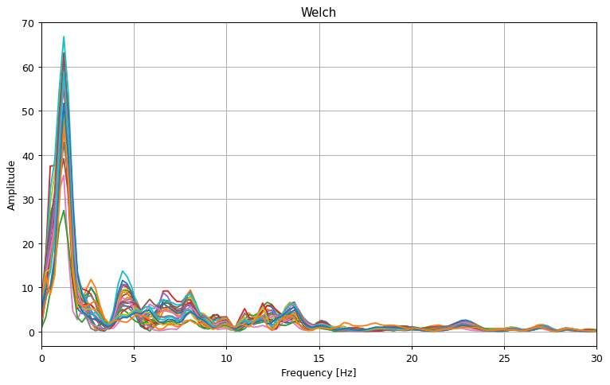
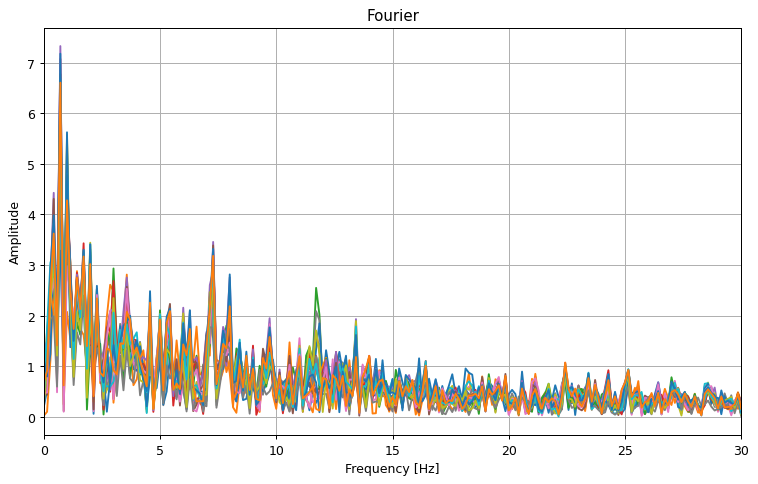

.. code:: ipython3

    from gcpds.utils import loaddb
    from matplotlib import pyplot as plt
    import numpy as np
    
    db = loaddb.BCI2a('BCI2a_database')
    db.load_subject(1)
    run, _ = db.get_run(0)
    fs = db.metadata['sampling_rate']
    # trial = run[0,0][:fs]
    trial = run[0]

Processing
==========

Basic and ready to use processing funtions.

Welch
-----

.. code:: ipython3

    from gcpds.utils.processing import welch, fourier

.. code:: ipython3

    W, X = welch(trial, fs=250, axis=1)
    
    plt.figure(figsize=(10, 6), dpi=90)
    plt.title('Welch')
    [plt.plot(W, Xi) for Xi in X]
    plt.xlim(0, 30)
    plt.grid(True)
    plt.xlabel('Frequency [Hz]')
    plt.ylabel('Amplitude')

.. parsed-literal::

    Text(0, 0.5, 'Amplitude')

Fourier
-------

.. code:: ipython3

    W, X = fourier(trial, fs=250, axis=1)
    
    plt.figure(figsize=(10, 6), dpi=90)
    plt.title('Fourier')
    [plt.plot(W, Xi) for Xi in X]
    plt.xlim(0, 30)
    plt.grid(True)
    plt.xlabel('Frequency [Hz]')
    plt.ylabel('Amplitude')

.. parsed-literal::

    Text(0, 0.5, 'Amplitude')

